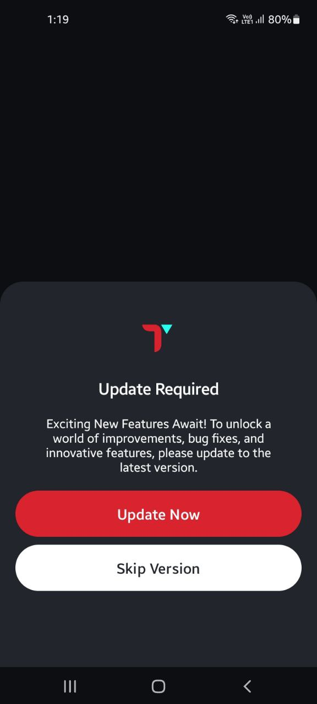
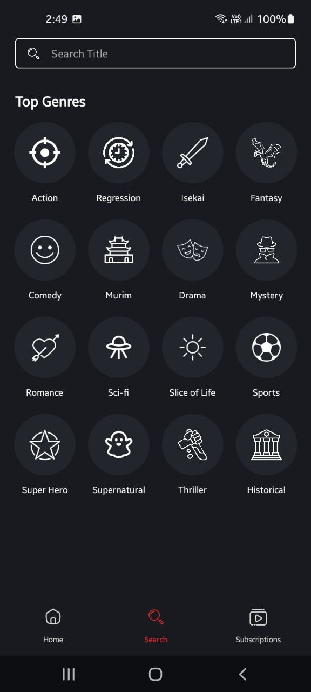

# ToonScrape Android App

## Overview
ToonScrape is an Android application developed in Kotlin using Jetpack Compose that provides a delightful and immersive reading experience for manhwa enthusiasts. The app allows users to explore and read manhwa from the internet, featuring a user-friendly UI and various convenient features.

## Features

### 1. Immersive Reading Mode
- Full immersion mode allows system bars to disappear while reading, providing an immersive and distraction-free reading experience.

|  |  |
|------------------------------------------------------------|------------------------------------------------------------|

### 2. Subscription Management
- Users can subscribe to their favorite manhwa series for easy access and updates.


### 3. Popular Manhwa
- Stay updated with what's popular nowadays in the world of manhwa.

## Screenshots

|  |  |  |
|------------------------------------------------------------|------------------------------------------------------------|------------------------------------------------------------|

## Demo Video
[Demo](https://drive.google.com/file/d/16THcRnmyTc4P0-XW5mW29tvRfH6wDcsX/view?usp=sharing)


## Getting Started

### Prerequisites
- Android Studio Hedgehog or later
- Kotlin version: 1.5.21
- Gradle version: 7.0.2

### Clone the Repository
```bash
git clone https://github.com/adityaSharma6356/ToonScrape.git
```

### Open in Android Studio
1. Open Android Studio
2. Click on "Open an existing Android Studio project"
3. Navigate to the directory where you cloned the repository and select the `ToonScrape` folder.

### Build and Run
Build and run the project using Android Studio on an emulator or a physical device.


## Acknowledgments
- Thanks to the [AsuraScans(AsuraToons)](https://asuratoon.com/) Scanlation group and community for their resources and translations.
